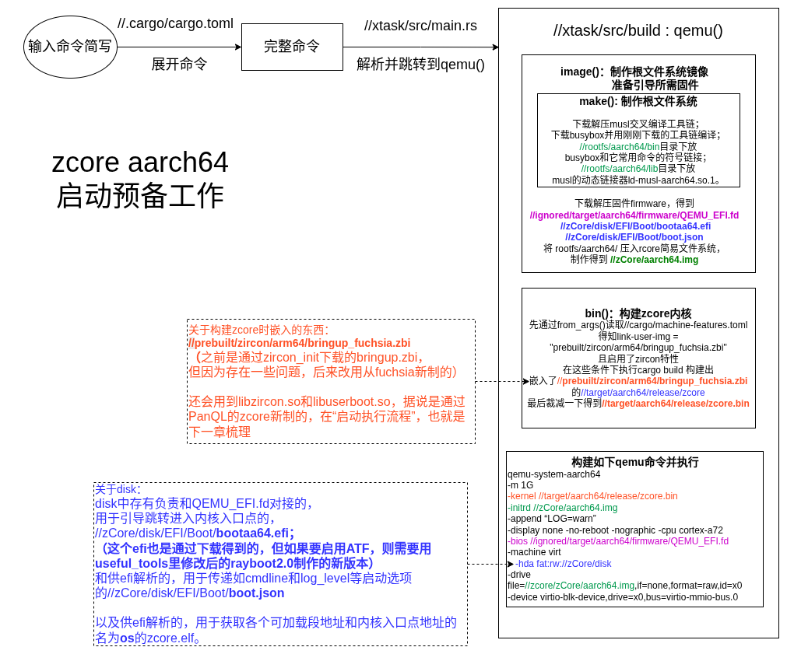
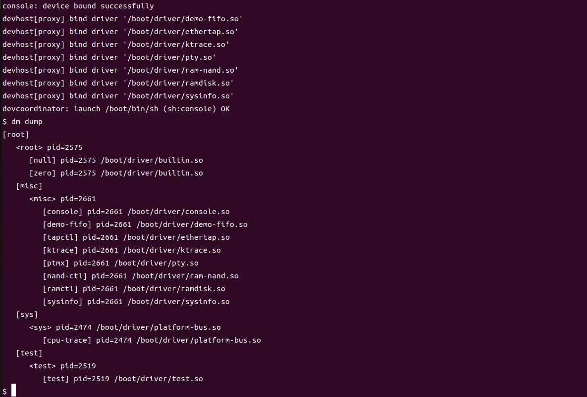

# zCore

本项目在 [zcore](https://github.com/rcore-os/zCore)项目的基础上进行开发，专注于完善zcore 系统在ARM aarch64架构下的功能完整性。

当前支持在bare-metal模式下，基于qemu启动aarch64的fuchsia系统

关于zcore的介绍请参考[zcore 原版README文档](README-origin.md)

## 项目构建

本项目提供一个docker环境，使用方法参考[docker使用说明](tools/docker/README.md)

- 安装rust

需要在docker环境或者本地开发平台安装rust，安装说明参考[rust组织](https://www.rust-lang.org/)

- 更新依赖

```
cargo +stable install cargo-binutils
cargo update-all
```


## 启动内核

如果需要从uefi开始引导启动，默认使用zircon模式，将启动fuchsia系统，命令如下

```bash
cargo qemu --arch aarch64
```
启动准备工作流程图如下，更详细的信息可见docs（TODO）



使用下面的命令可以从ATF开始启动

```bash
cargo qemu --arch aarch64 --firmware atf
```

成功启动将进入到console




## 注意事项

- 如果是第一次使用并想启用ATF，但遇到“BUFFER TOO SMALL”错误，需要用“useful_tools”里的新“bootaa64.efi”替换旧文件，旧文件路径在“zCore/disk/Boot/EFI/bootaa64.efi”
