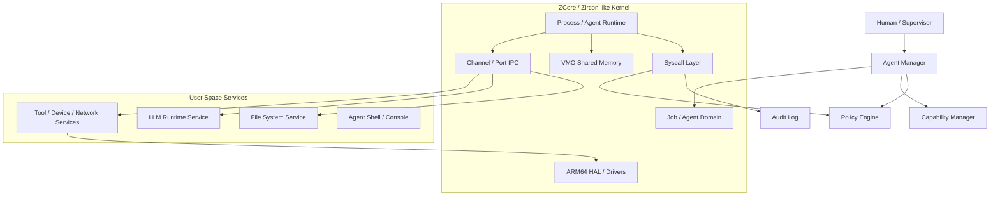

# AI Agent OS 开发计划草案

> 项目：ADTXL/zcore_test  
> 当前分支：zcore_fuchsia  
> 目标：在 zCore / Zircon-like 微内核基础上，探索并实现一个面向 AI Agent 的操作系统原型。

## 1. 当前项目基线判断

当前仓库是在 rcore-os/zCore 基础上的分支，重点已经收敛到：

- ARM64 / AArch64；
- bare-metal 模式；
- QEMU 启动；
- Zircon/Fuchsia 路线；
- Rust 实现的 Zircon-like kernel object / syscall / HAL；
- 已移除部分非目标平台与测试子模块，方向比较聚焦。

核心代码结构：

```text
zcore_test/
├── zCore/              # 内核入口、启动流程、平台 glue
├── kernel-hal/         # bare/libos HAL，内存、线程、timer、console、driver glue
├── zircon-object/      # Zircon kernel objects：Job/Process/Thread/Channel/VMO/Port 等
├── zircon-syscall/     # Zircon syscall 分发与实现
├── loader/             # Zircon/Linux 用户程序加载
├── drivers/            # UART/GIC/VirtIO/NVMe/Net/Input/Display 等驱动框架
├── z-config/           # 架构/平台配置
└── xtask/              # cargo qemu / build / rootfs 等任务封装
```

现有项目本身已经具备做 “Agent OS” 原型的几个关键支点：

1. **Zircon-style capability handle 模型**：天然适合表达 Agent 的权限边界。
2. **Job / Process / Thread 层级**：适合把 Agent 实例组织成可监管的任务树。
3. **Channel / Port / Socket / FIFO IPC**：适合构建 Agent-to-Agent、Agent-to-Service 消息通道。
4. **VMO / VMAR 内存对象**：适合后续做共享上下文、模型输入输出缓冲区、可审计 memory region。
5. **Job policy 雏形**：可扩展为 Agent sandbox policy、资源限制、危险动作拦截。
6. **AArch64 bare-metal 路线**：适合保留 OS 研究价值，而不是只做 Linux 上层框架。

## 2. 核心定位：AI Agent OS 到底是什么？

建议不要一开始把目标定成“跑大模型的完整 OS”。那会太散，也会被 GPU/模型运行时拖走。

更合理的定位是：

> **AgentOS 是一个以 capability、可审计 IPC、任务生命周期监管和资源/权限策略为核心的微内核式运行环境，用来承载多个 AI Agent、安全工具、外部环境接口和人类监督入口。**

也就是说，第一阶段重点不是“在内核里跑 LLM”，而是让 OS 原生理解：

- Agent 是一类特殊任务；
- Agent 有身份、目标、权限、上下文、预算、审计日志；
- Agent 之间通过结构化消息交互；
- Agent 访问文件、网络、设备、执行动作都需要 capability；
- 高风险动作可以被 OS 拦截、记录、等待人工确认；
- 系统能回放 Agent 的关键行为链路。

## 3. 建议的总体架构



## 4. 第一性设计原则

### 4.1 Agent 不是普通进程，而是受监管的任务主体

普通 OS 里进程只有 pid、uid、fd、地址空间。

AgentOS 里 Agent 至少需要：

```text
AgentId
AgentName
ParentAgent / OwnerJob
Goal / Mission
CapabilitySet
ResourceBudget
AuditStream
ContextVMO / MessageChannels
HumanApprovalPolicy
```

实现上不建议一开始新增完整对象体系，可以先扩展现有 `Job` / `Process` 之上的 metadata。

### 4.2 Capability 优先，而不是 UID/GID 优先

AI Agent 的危险点不在“它是谁”，而在“它能做什么”。

因此建议沿用 Zircon handle/right 模型：

- 文件访问：必须持有 File capability；
- 网络访问：必须持有 Net capability；
- 启动子 Agent：必须持有 SpawnAgent capability；
- 调用工具：必须持有 Tool capability；
- 修改系统配置：必须持有 Admin/System capability；
- 外发消息：必须持有 ExternalSend capability，并可要求人工确认。

### 4.3 IPC 必须结构化、可审计、可回放

Agent 间通信不要只看作 byte stream，应定义 Agent Message Envelope：

```text
struct AgentMessage {
    txid: u64,
    from: AgentId,
    to: AgentId | ServiceId,
    intent: MessageIntent,
    risk: RiskLevel,
    payload_type: PayloadType,
    payload_vmo: Option<Handle>,
    handles: Vec<Handle>,
    audit_tag: AuditTag,
}
```

第一阶段可以先不改 ABI，只在现有 Channel message payload 中定义协议。

### 4.4 人类监督是 OS 能力，不是应用层补丁

高风险动作默认经过 Policy Engine：

- 删除文件；
- 修改系统配置；
- 发邮件/消息/公网请求；
- 执行 shell；
- 访问敏感设备；
- 提权或扩大 capability。

Policy Engine 可以先做成用户态服务，内核只提供必要拦截点和审计 hook。

## 5. 分阶段开发路线

## Phase 0：基线复现与工程稳定化

目标：保证当前仓库可稳定构建、启动、调试。

任务：

- [ ] 固化 Docker / 本地构建环境；
- [ ] 确认 `cargo qemu --arch aarch64` 可稳定进入 console；
- [ ] 确认 `cargo qemu --arch aarch64 --firmware atf` 状态；
- [ ] 整理 QEMU 启动日志、已知问题、调试方法；
- [ ] 增加最小 smoke test 文档；
- [ ] 建立 `docs/agent-os/` 设计文档目录。

交付物：

- `docs/agent-os/00_baseline.md`
- 可复现启动命令；
- 一张当前启动链路图；
- 当前 syscall / object 支持矩阵初稿。

## Phase 1：AgentOS 设计文档与术语收敛

目标：先把概念边界定清楚，避免代码越写越散。

任务：

- [ ] 定义 Agent、Tool、Service、Capability、Policy、Audit 的关系；
- [ ] 明确哪些能力放内核，哪些能力放用户态；
- [ ] 梳理现有 Zircon object 与 AgentOS object 的映射；
- [ ] 定义 Agent Message 协议 v0；
- [ ] 定义 Agent manifest 格式 v0。

建议文档：

- `docs/agent-os/01_vision.md`
- `docs/agent-os/02_architecture.md`
- `docs/agent-os/03_agent_model.md`
- `docs/agent-os/04_capability_policy.md`
- `docs/agent-os/05_ipc_protocol.md`

## Phase 2：最小 Agent Runtime 原型

目标：在现有 Zircon 模式上跑出最小 Agent 概念。

最小模型：

```text
Agent Manager
  ├── 创建 Agent Job
  ├── 启动 Agent Process
  ├── 分配初始 Channel
  ├── 下发 capability manifest
  └── 收集退出码与审计事件
```

任务：

- [ ] 新增 `agent-object` 或先在 `zircon-object` 中增加 Agent metadata；
- [ ] 在用户态实现 `agent_manager` demo；
- [ ] 使用 Channel 建立 AgentManager ↔ Agent 的控制通道；
- [ ] 定义 `agent_manifest`，包含名称、目标、权限、预算；
- [ ] 实现一个 dummy agent：接收任务、返回结果、退出。

交付物：

- 能启动一个 dummy agent；
- console 中能看到 Agent lifecycle；
- Agent 不能越权访问未授予 capability。

## Phase 3：Capability / Policy / Audit 三件套

目标：让 AgentOS 和普通进程系统拉开差异。

任务：

- [ ] 扩展 JobPolicy，增加 Agent 相关 policy condition；
- [ ] 增加 audit event 数据结构；
- [ ] 在关键 syscall 上挂 audit hook；
- [ ] 实现 Policy Engine 用户态服务；
- [ ] 支持 allow/deny/log/ask-human 四种策略结果；
- [ ] 先覆盖对象创建、channel 发送、process 创建、VMO exec、debug/resource 访问。

建议新增 policy condition：

```text
AgentSpawn
AgentSendMessage
AgentUseTool
AgentExternalIO
AgentRequestCapability
AgentModifySystem
AgentExecCode
```

交付物：

- `agent_policy.json` 示例；
- 一次 Agent 行为的审计日志；
- 拒绝越权行为的 demo。

## Phase 4：Tool Service 与外部世界接口

目标：Agent 可以通过 OS 管理的工具接口做事，而不是直接裸奔。

任务：

- [ ] 定义 Tool Service ABI / IPC 协议；
- [ ] 实现最小工具：echo、clock、kv-store；
- [ ] 后续扩展 file、net、shell、device；
- [ ] 每个工具调用都带 capability、risk、audit tag；
- [ ] 高风险工具调用进入 human approval flow。

交付物：

- dummy agent 调用 tool service；
- policy 可禁止某个工具；
- audit log 可回放工具调用链路。

## Phase 5：LLM Runtime Service 接入

目标：把 LLM 作为用户态服务，而不是内核组件。

建议路线：

- 第一阶段不要在 bare-metal 内直接跑大模型；
- 先做 `LLM Runtime Service` 抽象；
- QEMU / bare-metal 内的 Agent 通过 IPC 请求 LLM；
- LLM backend 可以临时桥接到 host 侧模型服务；
- 后续再考虑本地小模型或 NPU/GPU 驱动。

任务：

- [ ] 定义 prompt/request/response message；
- [ ] 支持上下文 VMO；
- [ ] 支持 token budget；
- [ ] 支持 system prompt / tool schema 的 capability 约束；
- [ ] 审计 prompt 摘要，而不是默认记录全部敏感内容。

交付物：

- Agent 发起一次 LLM 请求；
- LLM 返回结构化计划；
- Agent 根据 policy 调用允许的工具。

## Phase 6：演示场景

建议第一个 demo 不要太大，做成：

> “受限 Agent 接收一个任务，只能访问 clock 和 kv-store，尝试访问 shell 被拒绝，完整行为被 audit log 记录。”

第二个 demo：

> “Planner Agent 把任务拆给 Worker Agent，二者通过 Channel 通信，Worker 只能持有被授权的 Tool capability。”

第三个 demo：

> “Agent 请求执行高风险动作，Policy Engine 返回 AskHuman，console 显示待确认请求。”

## 6. 推荐近期 2 周计划

### 第 1-2 天：基线复现

- 拉齐构建环境；
- 跑通 QEMU；
- 记录启动链路；
- 建立 agent-os 文档目录。

### 第 3-4 天：设计收敛

- 写 `01_vision.md`；
- 写 `02_architecture.md`；
- 写 `03_agent_model.md`；
- 明确 Agent 是 Job/Process metadata 还是新 object。

建议：**第一版不要新增内核 object，先复用 Job/Process + metadata + manifest。**

### 第 5-7 天：Agent Message v0

- 定义 message envelope；
- 基于 Channel 做 demo；
- AgentManager 与 DummyAgent 通信；
- console 打印生命周期。

### 第 8-10 天：Capability / Policy v0

- 扩展 JobPolicy 或增加 AgentPolicy 包装层；
- 实现 allow/deny/log；
- 先不做人类确认，只做策略拒绝；
- 给 Channel write / object create 增加可观察点。

### 第 11-14 天：Audit v0 + Demo

- 定义 audit event；
- 输出到 debuglog / console；
- 完成第一个 demo：受限 Agent 调用允许工具，越权动作被拒绝；
- 写阶段总结。

## 7. 技术风险与建议

### 风险 1：目标过大

“AI Agent OS” 很容易膨胀成：内核、LLM、工具系统、安全策略、UI、分布式、多模态全部都想做。

建议：第一阶段只做 **Agent 生命周期 + capability + IPC + audit**。

### 风险 2：过早改 syscall ABI

不建议一开始新增大量 syscall。优先在用户态协议和现有 Channel/Job/Process 上验证模型。

### 风险 3：把 LLM runtime 放进内核

不要这么做。LLM 是用户态服务，内核只管理隔离、权限、审计和资源。

### 风险 4：只做应用层 Agent 框架，失去 OS 特色

如果只在用户态写 agent manager，那和普通 Linux agent framework 差异不大。

要突出 OS 价值，应尽早实现：

- capability enforcement；
- policy hook；
- syscall/object audit；
- job/process 生命周期监管；
- handle-based authority。

## 8. 下一步建议

我建议下一步先做三件事：

1. **跑通并记录当前 QEMU 启动基线**；
2. **新增 `docs/agent-os/`，把 vision / architecture / agent model 写清楚**；
3. **做 AgentManager ↔ DummyAgent 的 Channel 通信 demo**。

这三件事完成后，再决定是否需要新增 `agent-object` crate，还是继续在 `zircon-object` / `zircon-syscall` 上扩展。
